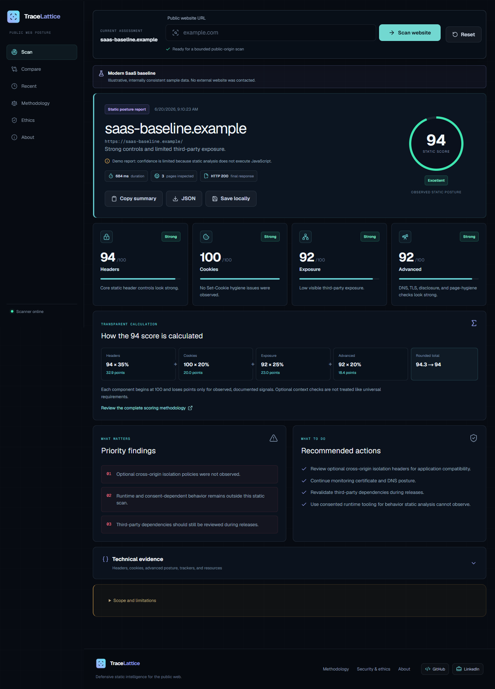

# TraceLattice

TraceLattice is a defensive web security posture scanner for public websites. It runs bounded scans of public HTTP/S origins and turns observable headers, cookies, trackers, DNS, TLS, and resource signals into an explainable report.

[Live Demo](https://tracelattice.vercel.app) | [Source Code](https://github.com/immanuelgn/TraceLattice)



## Portfolio Highlights

- Built a production-style Next.js 16 App Router application with typed API routes, deterministic scoring, and responsive report UX
- Implemented SSRF-aware URL validation, DNS/IP blocking, redirect validation, response caps, timeouts, and rate limiting
- Added optional free-tier hosted-browser rendering for JavaScript-populated pages through Cloudflare Browser Rendering
- Designed transparent evidence views: score arithmetic, headers, cookies, trackers, third parties, DNS/TLS posture, limitations, JSON export, and local history
- Wrote focused tests for URL safety, private IP blocking, headers, cookies, trackers, third parties, scoring, report validation, and demo consistency

## Features

- Standard scan for public origins and up to two same-origin HTML pages
- Optional Enhanced scan that opens the public page in a hosted browser to inspect content loaded after JavaScript runs
- Evaluates CSP, HSTS, frame protection, MIME sniffing, referrer policy, permissions policy, and cross-origin controls
- Reviews `Secure`, `HttpOnly`, and `SameSite` cookie attributes without retaining cookie values
- Identifies third-party domains, scripts, trackers, forms, mixed content, and supply-chain exposure
- Checks TLS certificates, SPF, DMARC, MX, CAA, DNSSEC, MTA-STS, TLS-RPT, and `security.txt`
- Produces deterministic component scores with visible deductions and weighted calculations
- Supports JSON export, summary copy, side-by-side comparison, browser-local scan history, and a global lifetime scan counter
- Includes responsive loading, cancellation, timeout, validation, rate-limit, and failure states

## Tech Stack

- Next.js 16 App Router
- React 19
- TypeScript
- Node.js
- Tailwind CSS
- Vitest
- Vercel Functions
- Cloudflare Browser Rendering (optional Enhanced scan)
- Upstash Redis (global lifetime scan counter)

## Security Engineering

TraceLattice treats every submitted URL and redirect as untrusted.

- Accepts only public HTTP and HTTPS origins on standard ports
- Rejects embedded credentials, localhost, internal hostnames, and unsafe protocols
- Resolves and validates IPv4 and IPv6 addresses before requests
- Blocks private, reserved, loopback, link-local, multicast, carrier-grade NAT, and cloud metadata ranges
- Revalidates every redirect destination
- Limits redirects, execution time, response size, pages, parsed resources, and hosted-browser waits
- Sends only the public URL to the hosted browser provider in Enhanced scan
- Keeps fetched and rendered HTML in memory only and returns user-safe API errors

## Architecture

```text
Browser
  -> POST /api/scan
  -> Normalize and validate target
  -> Resolve DNS and block unsafe destinations
  -> Fetch with controlled redirects
  -> Optional: open the public page with Cloudflare Browser Rendering and parse the rendered HTML
  -> Parse bounded static or rendered HTML
  -> Analyze headers, cookies, resources, TLS, and DNS
  -> Calculate deterministic scores and recommendations
  -> Return a typed ScanReport
```

The final score is calculated from four components:

```text
round(
  headers  * 0.35 +
  cookies  * 0.20 +
  exposure * 0.25 +
  advanced * 0.20
)
```

Each component begins at 100 and receives capped deductions for observed findings. The report displays the component values, deductions, evidence, and final arithmetic.

## Local Development

Requires Node.js 20.9 or newer.

```bash
npm install
npm run dev
```

Open [http://localhost:3000](http://localhost:3000).

## Optional Enhanced Scan Setup

Standard scan works without external services. To enable Enhanced scan for JavaScript-rendered pages, create a Cloudflare API token with Browser Rendering access and set:

```bash
CLOUDFLARE_ACCOUNT_ID=your_account_id
CLOUDFLARE_API_TOKEN=your_token
```

Optional override for testing or provider changes:

```bash
CLOUDFLARE_BROWSER_RENDER_ENDPOINT=https://api.cloudflare.com/client/v4/accounts/{accountId}/browser-rendering/content
```

Enhanced scan is useful when you want a fuller look at trackers, ads, forms, or scripts that appear only after the page finishes loading, or when the Standard report looks sparse. It still follows the same safety rules: public HTTP/S only, no credentials, no login, no clicking, no form submission, no consent bypass, and no retained page bodies.

## Testing

```bash
npm run lint
npm run test
npm run build
npm audit --omit=dev
```

The test suite covers URL validation, private IP blocking, header analysis, cookie analysis, tracker detection, third-party extraction, scoring behavior, report validation, and demo-score consistency.

## Limitations

- Standard scan does not execute target JavaScript
- Enhanced scan renders JavaScript once through a hosted browser API, but does not capture full browser network bodies or interaction-only behavior
- No authentication, form submission, exploitation, consent bypass, or broad crawling
- Runtime, consent-gated, authenticated, delayed, and region-specific behavior may not be visible
- Scores are evidence-based heuristics, not compliance certifications or vulnerability assessments
- DNS validation does not provide connection-time IP pinning against DNS rebinding

Additional safeguards are documented in [SECURITY_ETHICS.md](SECURITY_ETHICS.md) and [COST_SAFETY.md](COST_SAFETY.md).

## License

[MIT](LICENSE)
